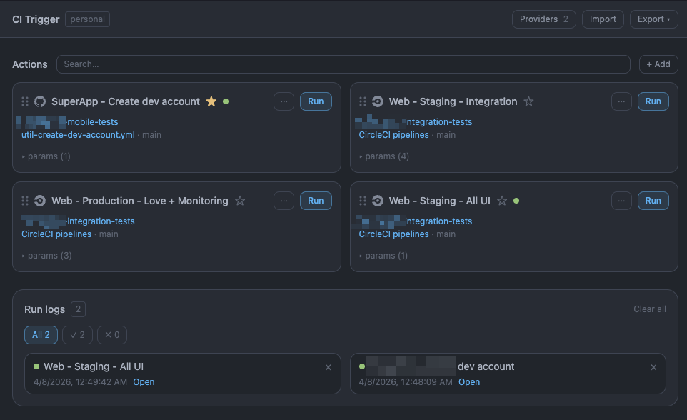

# CI Trigger

A personal browser-based tool for triggering CI pipelines via personal access tokens. Supports GitHub Actions workflow dispatch and CircleCI pipelines.

All data is stored in your browser's `localStorage` - no backend, no server.



## Features

- **GitHub Actions** - trigger workflow dispatch with custom inputs
- **CircleCI** - trigger pipelines with custom parameters
- **Run logs** - history of triggered runs with status and links
- **Run with params** - one-off run with overridden inputs/parameters without editing the action
- **Import / Export** - backup and share action configs as JSON
- **Extensible provider registry** - add new CI providers in one place (`src/lib/providerMeta.ts` + `src/lib/providers.ts`)

## Development

```bash
npm install
npm run dev      # start dev server
npm run build    # type-check + build
npm run lint     # run ESLint
npm run test     # run tests
```

## Deployment

### GitHub Pages

Build and deploy via GitHub Actions. Add the following to your workflow:

```yaml
- name: Build
  run: npm run build
  env:
    VITE_CIRCLECI_PROXY: ${{ secrets.VITE_CIRCLECI_PROXY }}
```

### CircleCI CORS proxy

CircleCI's API does not allow direct browser requests from arbitrary origins. A [Cloudflare Worker](https://workers.cloudflare.com) is needed as a proxy.

**Worker code:**

```js
export default {
  async fetch(request) {
    if (request.method === "OPTIONS") {
      return new Response(null, {
        headers: {
          "Access-Control-Allow-Origin": "*",
          "Access-Control-Allow-Methods": "GET, POST, PUT, DELETE, OPTIONS",
          "Access-Control-Allow-Headers": "*",
        },
      });
    }

    const url = new URL(request.url);
    const targetUrl = "https://circleci.com/api/v2" + url.pathname + url.search;

    const response = await fetch(targetUrl, {
      method: request.method,
      headers: request.headers,
      body: request.method !== "GET" ? request.body : undefined,
    });

    const newHeaders = new Headers(response.headers);
    newHeaders.set("Access-Control-Allow-Origin", "*");

    return new Response(response.body, {
      status: response.status,
      headers: newHeaders,
    });
  },
};
```

Deploy the Worker, then set `VITE_CIRCLECI_PROXY=https://your-worker.workers.dev` as a GitHub Actions secret. GitHub API works directly from the browser without a proxy.

### Docker

```bash
docker build -t ci-trigger-ui .
docker run -p 8080:80 ci-trigger-ui
```

Open `http://localhost:8080`.

To pass the CircleCI proxy URL at build time:

```bash
docker build --build-arg VITE_CIRCLECI_PROXY=https://your-worker.workers.dev -t ci-trigger-ui .
```

## Environment variables

| Variable              | Description                                                                                                         |
| --------------------- | ------------------------------------------------------------------------------------------------------------------- |
| `VITE_CIRCLECI_PROXY` | Base URL for CircleCI API requests (Cloudflare Worker URL). Falls back to `https://circleci.com/api/v2` if not set. |

For local development, create `.env.local`:

```
VITE_CIRCLECI_PROXY=https://your-worker.workers.dev
```
